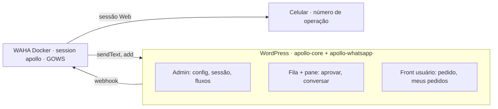
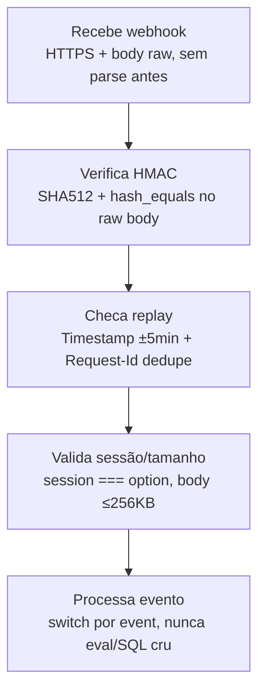
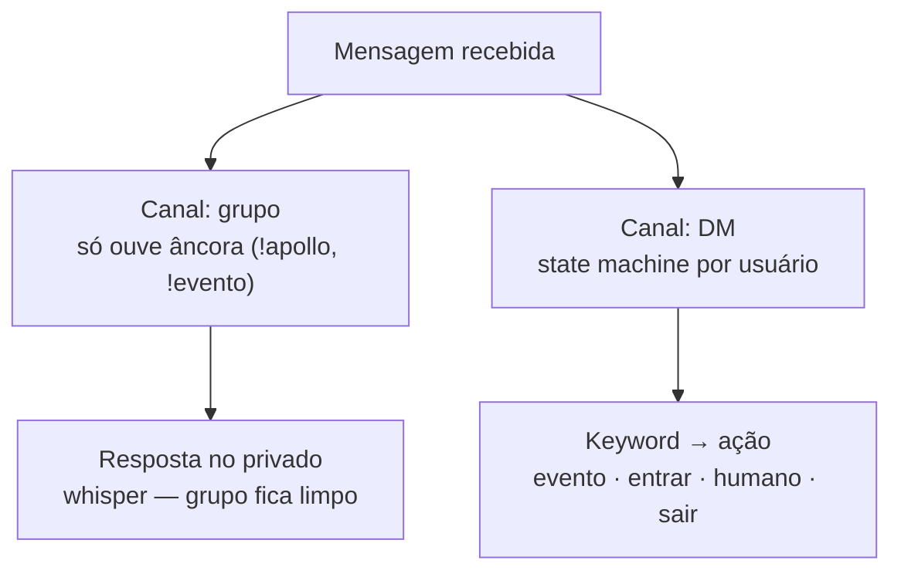
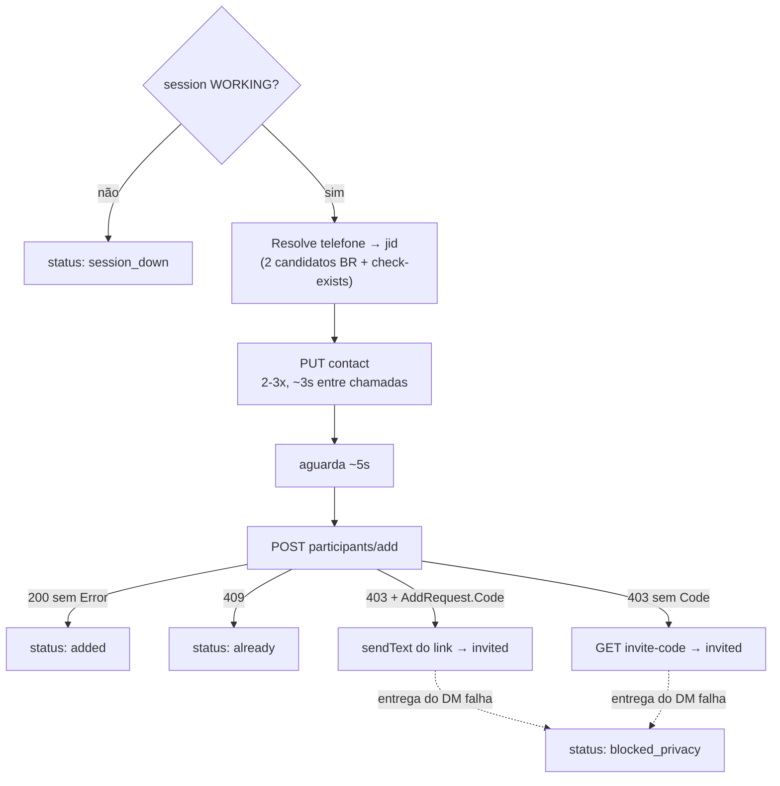

# apollo-waha — blueprint macro

> Fonte de naming/slugs canônica: `waha-registry.json` (arquivo irmão deste). Este documento é a leitura humana — diagramas + referência rápida.

## 1. Os 3 processos

- **[A] WordPress** — PHP, `apollo-core` + `apollo-whatsapp`. Não segura sessão do Zap. Se dorme, o Zap continua, o plugin não vê.
- **[B] WAHA Docker** — session `apollo`, engine **GOWS**. Se dorme, o site continua, fila e pane ficam paradas.
- **[C] Celular de operação** — nunca o número Apollo verde/Business. Abrir o app ~1×/semana.

## 2. Portão de segurança do webhook

Qualquer falha em qualquer portão → `401`, loga, para. Exceção: `Request-Id` já visto → `200` vazio (ack sem reprocessar — o WAHA retria erro, então idempotência é obrigatória). `permission_callback` da REST route nunca é `is_user_logged_in`: é máquina, auth = criptografia, fail-closed.

## 3. Roteamento de mensagem — grupo vs DM

Grupo nunca recebe auto-reply — só espelha na pane a menos que a âncora seja usada, e mesmo assim a resposta cai no DM. Estado `HUMAN` no DM cala o bot por 2h ou até o admin liberar.

## 4. Cadeia de add ao grupo

Nunca retry em loop no `participants/add` — 403 não é logout de sessão, é privacidade do usuário. O link de convite é o caminho padrão em Rio; o add direto é bônus.

## 5. Telas

| # | Tela | Slug de menu | Audiência |
|---|---|---|---|
| 1 | Settings | `apollo-whatsapp-settings` | admin |
| 2 | Sessão (faixa viva, topo da 1) | — | admin |
| 3 | Fila de entrada | `apollo-whatsapp-queue` | admin |
| 4 | Pane (chat mirror) | `apollo-whatsapp-pane` | admin |
| 5 | Fluxos (keywords) | `apollo-whatsapp-flows` | admin |
| 6 | Botão "quero entrar" | bloco no perfil/evento | usuário |
| 7 | "Meus pedidos" | bloco no perfil | usuário |
| L | WAHA Dashboard | container, ex. `127.0.0.1:3000` | só admin, setup/debug |

## 6. Status da fila (canônico)

`queued` → `adding` → `added` \| `already` \| `invited` \| `pending_approval` \| `blocked_privacy` \| `rejected` \| `session_down`

> `blocked_privacy` substitui o antigo `blocked` — nomeia a razão, não só o estado (ver `resolution_notes` no registry). Botão de aprovar tem label **"Processar entrada"**, nunca promete "entrou".

## 7. Segurança — checklist rápido

- [ ] HMAC key ≥ 32 bytes, gerada no activate, guardada em `apollo_wa_hmac_key` (option não-autoload, **por session**, não env global)
- [ ] `hash_hmac('sha512', $raw, $secret)` comparado com `hash_equals` — nunca `===`
- [ ] Janela de timestamp ±5min + dedupe por `Request-Id` (transient `apollo_wa_hook_{id}`, TTL 10min)
- [ ] `session` do payload bate com a option, senão drop
- [ ] Body > 256KB → `413`
- [ ] Outbound sempre leva `X-Api-Key` (`apollo_wa_api_key`)
- [ ] WAHA nunca público — bind local/rede Docker
- [ ] Número Apollo verificado nunca entra nessa sessão

## 8. Fora de escopo v1

- Clonar o WhatsApp Web inteiro no WP (mídia, 400 chats, status) — fica no Dashboard (tela L)
- Chatwoot / Typebot / n8n — só se um dia tiver vários atendentes
- Auto-reply em toda mensagem do grupo
- `message.reaction` → feature "WOW" (fase 2; evento continua assinado, sem handler no MVP)
- WhatsApp Cloud API oficial / Coexistence — só se broadcast em escala ou templates OTP virarem necessidade

## 9. Engine e ambiente

- Engine: **GOWS** (whatsmeow/Go) — nunca NOWEB (corrompe sessão) nem Baileys/WEBJS em produção
- Keepalive nativo do motor, sem daemon extra: `WAHA_GOWS_KEEPALIVE_INTERVAL_MIN=20`, `WAHA_GOWS_KEEPALIVE_INTERVAL_MAX=25`
- Volume persistente: `./sessions:/app/.sessions`
- `WAHA_DASHBOARD_ENABLED=false` em produção fora de debug
